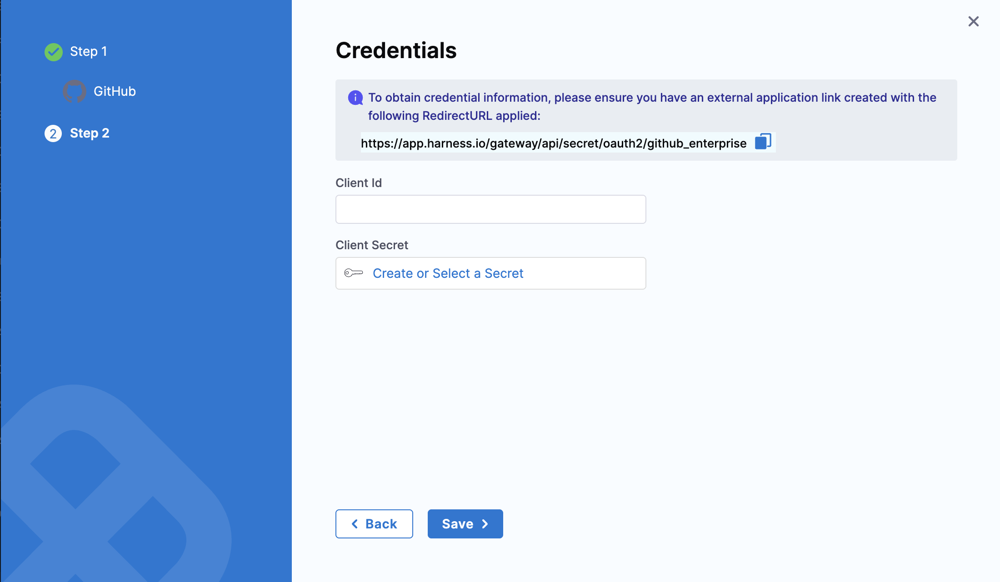
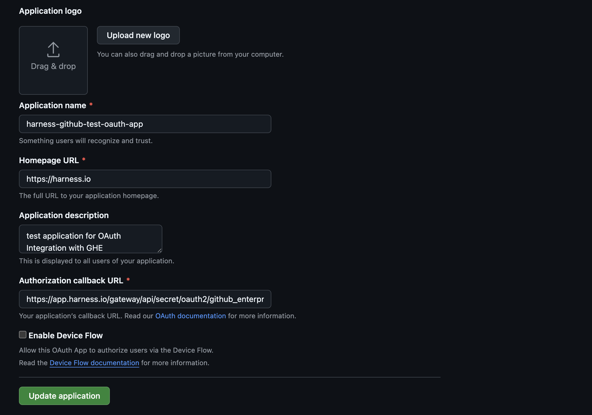
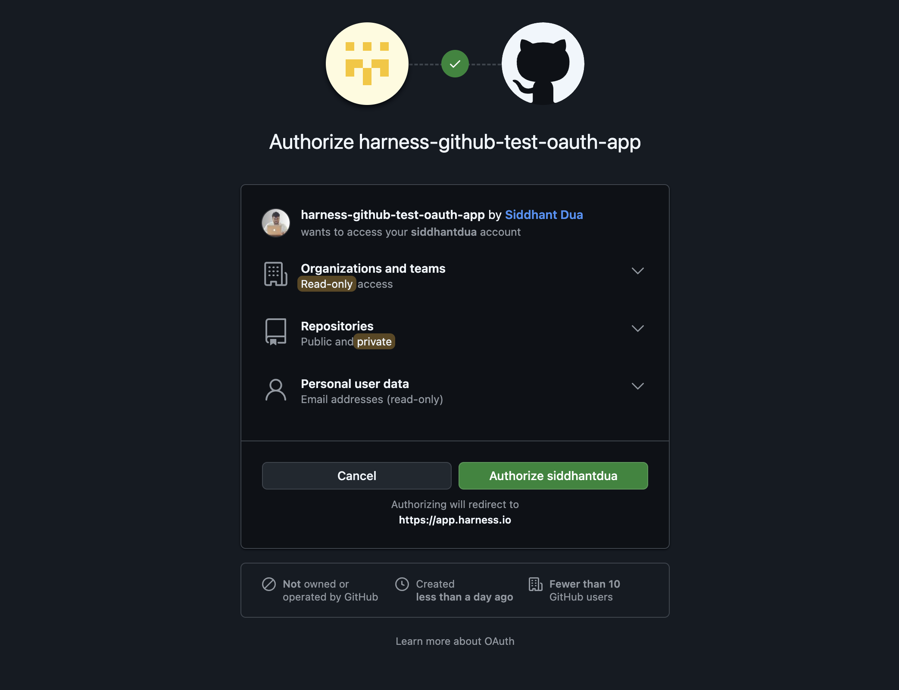

You can store configurations for your resources, such as pipelines and input sets, in Git using Harness Git Experience. Harness fetches user credentials from the Harness account and uses the corresponding user name as the author of the commit.

You can push configuration changes using your own credentials by integrating OAuth with Git. 
When you integrate OAuth with Git Experience, the credentials are stored in your Harness account user profile. These credentials are used for any subsequent commits.

:::important
Harness will continue to use the user name corresponding to the account if you don't integrate OAuth with Git Experience.
:::

This topic explains how to configure OAuth for Git Experience in Harness.

## Configure OAuth for Git provider

Harness supports OAuth integration for the following Git providers: 
* GitHub
* GitLab
* Bitbucket SaaS
* Self-hosted Bitbucket

:::info note
Harness does not support OAuth integration for Azure repos. Additionally, please note that we don't support OAuth for On-prem GIT systems.
:::
This topic explains how to configure OAuth for GitHub.

To configure your credentials for Git: 

1. Go to your user profile in Harness.
2. In **Connect to a Git Provider**, select **GitHub**.

   

3. Select **Connect**.
   The OAuth settings for the selected Git provider appear.

   

4. Select **Authorize**.
   Harness fetches the corresponding OAuth token associated with the Git provider and displays it under **Access token for Git providers**.

   

:::info note
You can delete access tokens you no longer need. Under **Access tokens for Git providers**, select the trash can icon that corresponds to the Git provider token you want to delete. A confirmation message appears, asking if you want to delete the SCM. After you confirm, Harness removes the configuration.
:::

### Configure OAuth for GitHub Enterprise

Harness supports OAuth integration for GitHub Enterprise. **As a prerequisite, you need to create an OAuth App in your GitHub Enterprise instance.**

Check out the instructions provided in the GitHub documentation on [Creating an OAuth App](https://docs.github.com/en/apps/oauth-apps/building-oauth-apps/creating-an-oauth-app).

As you begin setting up the OAuth App: 

- You must **provide the Authorization callback URL**. Initially, you can **provide any valid URL to proceed**. Later, this URL will be updated to the URL provided during **New Provider** set-up.

- Keep the **Client ID** and **Client Secret** handy. You will need them to create the provider in Harness.

:::info note

Currently, OAuth for GitHub Enterprise is behind the feature flag and `PIPE_ENABLE_GITHUB_ENTERPRISE_PROVIDER_FLOW`. Please contact [Harness support](mailto:support@harness.io) to enable this feature.

:::

To configure your credentials for GitHub Enterprise:

1. Navigate to **Account Settings** in Harness.
2. Select Providers, Click on **New Provider**.

3. Select **GitHub** as a provider. 
4. Enter the **Name** and **Domain URL** of the provider. The **Domain URL** is the URL of your GitHub Enterprise instance.
5. Specify the **Secret Manager**. This is where the token related to GitHub Enterprise will be stored.
6. Specify the **Delegate Selector**. Click on continue.

7. Copy the Redirect URL provided on the Harness Credentials page and use it to update the Authorization callback URL in your GitHub Enterprise OAuth App.

8. Copy the Client ID and generated Client Secret from your GitHub Enterprise OAuth App and use them to complete the provider's setup.

Now that the GitHub Enterprise provider is configured, navigate to the user profile, click on Profile Overview. Find the **Connect to a Provider** option, click on **Select a Provider**, CLick on **Custom Provider** section and select the provider you earlier created. Click on **Connect**.

Click on **Authorize** on the GitHub auth page, and the **access token** will be created.

### Configure OAuth for Self-hosted Bitbucket provider

To configure your credentials for Self-hosted Bitbucket provide:

1. Go to your user profile in Harness.
2. Under Account providers, click on **New Provider**.

3. Select **Bitbucket** as a provier.
4. Enter the **Name** and **Domain URL** of the provider. 
5. Specify the **Secret Manager**. This is where you have the access token related to the BitBucket stored.
6. Specify the **Delegate Selector**. Click on continue.

7. Copy the Redirect URL provided on the Harness Credentials page.

8. Now, navigate to the settings of your self-hosted Bitbucket. Click on **Application Links**, then click on **Create Link**.
9. Enter the **Name**. Under the **Redirect URL** provide the URL you previously copied from the Bitbucket Configuration step and save it.
10. Navigate back to **Application Links** page, click on the settings for the application you created, then click on **View Credentials**. Copy the **Client ID** and the **Client Secret**, and use these to configure the provider on the Harness Credentials page. Save it.

Now that the Bitbucket provider is configured, navigate to the user profile page, click on **Profile Overview**
Under **Connect to a Provider**, click on **Select a Provider**, CLick on **On-Prem** section and select the provider you earlier created. Click on **Connect**.

 Once you select **Alow** on the Bitbucket page, the access token will be created.

### Configure OAuth for Self-hosted Gitlab provider

:::note
Currently, support for OAuth configuration with the self-hosted and onprem Gitlab provider is behind the feature flag and `PIPE_ENABLE_GITLAB_ON_PREM_FLOW `. Please contact [Harness support](mailto:support@harness.io) to enable this feature.

Harness Delegate version 843xx or later is required for this feature.
:::

To configure your credentials for Self-hosted Gitlab provide:

1. Go to your user profile in Harness.
2. Under Account providers, click on **New Provider**.

3. Select **Gitlab** as a provier.
4. Enter the **Name** and **Domain URL** of the provider. 
5. Specify the **Secret Manager**. This is where you have the access token related to the Gitlab stored.
6. Specify the **Delegate Selector**. Click on continue.

7. Go to **User Settings** and under the settings click on **Applications**. Add the **Name** and the **Redirect URI** that you previously copied from the Gitlab Configuration step. Add the **Scopes** and **Save Application**. 

8. Once you save the application, copy the **Application ID** and **Secret**  and use these to configure the provider on the Harness Credentials page. 

Now that the Gitlab provider is configured, navigate to the user profile page, click on **Profile Overview**.
Under **Connect to a Provider**, click on **Select a Provider**, CLick on **On-Prem** section and select the provider you earlier created. Click on **Connect**.

Click on **Authorize** on the Gitlab page, the access token will be created.

## Commit changes to Git with the configured OAuth token

To commit changes to Git using the configured OAuth token: 

1. Go to an existing remote pipeline or [create](./configure-git-experience-for-harness-entities.md#add-a-remote-pipeline) a new one.
2. Edit the pipeline and select **Save**.
   The **Save Pipelines to Git** settings appear. Harness displays the user name being used for this commit.

   

3. Select **Save**.

   :::important
   If you have not configured OAuth for Git, Harness prompts you to set up an access token in the user profile to use for Git commits.
   You can do one of the following to commit your changes to Git: 
   * Select **Connect** to configure OAuth for Git and use your Git credentials for the commit, and then select **Save**. This is optional.
   * Select **Save** to use the credentials from the Git connector for the commit.

   

4. Go to your branch in the Git repository. It now displays the author details beside the commit.
   
:::info note
We currently do not support OAuth authentication for Git providers that use vanity URLs.
:::

## Generating an OAuth Access Token with VanityURLs as the Host

Harness supports the creation of OAuth Access Tokens when users are using VanityURLs as the host. This functionality is currently available for **GitHub** and **Gitlab**. 

### Github

In case of [Github](https://docs.github.com/en/apps/oauth-apps/building-oauth-apps/authorizing-oauth-apps#redirect-urls), customers can follow the steps outlined in [Configuring OAuth for Git provider](#configure-oauth-for-git-provider), and Harness will automatically update configurations.

### Gitlab

For [GitLab](https://docs.gitlab.com/ee/integration/oauth_provider.html#adding-an-application), customers need to ensure that their Vanity URL is added to the OAuth application's redirect URI list. The OAuth application is set up by Harness, so customers will need to contact [Harness Support](mailto:support@harness.io) to complete this process. They must provide their subdomain to have the Vanity URL whitelisted.

Example: If your subdomain is `yourcompany.harness.io`, the redirect URI would be:

`https://yourcompany.harness.io/gateway/api/secret/oauth2/gitlab`

### Supported Vanity URL Format
Currently, Harness supports vanity URLs in the format `https://<YOUR_SUBDOMAIN>.harness.io`.
Invalid combinations include:

1. `https://<YOUR_SUBDOMAIN_1>.<YOUR_SUBDOMAIN_2>.harness.io`
2. `https://app.harness.io/<YOUR_SUBDOMAIN>`

## Enforce OAuth for commits

You can enforce OAuth for commits pushed from Harness to your Git provider.

To enable this setting:-

Navigate to **Account Settings** -> **General** -> **Default Setting** -> **Git Experience** -> **Enable OAuth for Commits**

If this setting is enabled but OAuth is not configured for your account, any attempt to commit changes from Harness to Git will fail, and you'll see an error like this:

To resolve this, you must [Configure Oauth for your Git Provider](#configure-oauth-for-git-provider) before making any changes.

